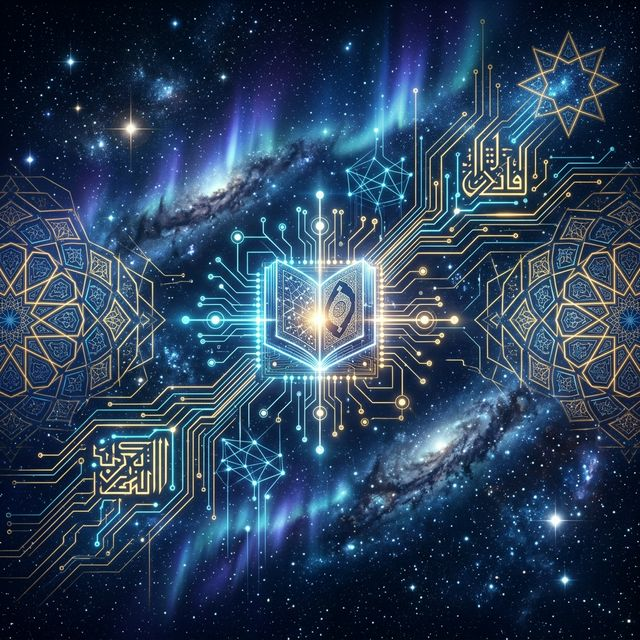

# 📖 Quantum Implementation of the Holy Quran
### *Bridging the gap between Divine Cosmic Laws and Quantum Mechanics.*

> *"The Quran is a treasure trove of infinite wisdom, detailing the absolute mechanics of the universe. We cannot truly comprehend this Divine Guidance until we physically simulate it. I have decided to bridge this gap through Quantum Computing."*

## 💎 The Core Philosophy & Practical Implementation

The Holy Quran is not merely a book of historical recitation; it is the **Master Blueprint of the Universe**. It contains precise, flawless systems governing astrophysics, embryology, thermodynamics, geology, and immutable justice. 

However, much of this "Knowledge of the World" has remained theoretical to the modern reader. **This repository is the laboratory where Divine Revelation meets Practical Implementation.**

By using Quantum Computing (IBM Qiskit) as our multi-dimensional tool, this project extracts the deep structural physics of the Quran and deploys them mathematically. We are practically implementing the Holy Quran by rigorously coding its absolute physical systems onto quantum silicon to solve the most complex, trillion-dollar engineering problems of the 21st century.

---

## 🌌 The Vision: A Quantum Unified Field Theory

This project treats the Quran as the ultimate **Unified Field Theory**. It is an ambitious attempt to take the "Source Code of the Creator" and actively execute it across hyper-advanced scientific domains:

### ⚛️ Astrophysics & Cosmic Entropy
Implementing quantum arrays to model the destruction and dispersion of physical matter, simulating exactly what happens when the gravitational bindings of the cosmos break apart.

### 🧬 Quantum Biology & Genomics
Executing algorithmic pathfinding and sequencing to decode how biological structures flawlessly transfer energy using zero-friction quantum paths, proving the divine proportioning of life.

### 🌋 Thermodynamics & Geological Stability
Utilizing Eigensolvers and Hamiltonian time-evolution to actively simulate deep tectonic bedrock anchoring systems and extreme thermal separation.

### ⚖️ Cryptography & Immutable Ledgers
Translating the ultimate laws of cosmic symmetry into unhackable anomaly detection—finding fractional imbalances in global trading ecosystems and permanently enforcing absolute mathematical justice.

### 📡 Distributed Mesh Networks & Error Protection
Architecting global, entangled satellite grids that behave like indestructible constellations—networks that natively self-repair and instantly quarantine malicious destruction, securing a perfectly preserved slate of data.

---

## ⚙️ The Mission: From Recitation to Simulation

For too long, the Quran has been treated merely as a book of the past. We are proving it is the undeniable framework of the deep future. Most people leave the Quran on the shelf. Some carry it in their hearts. We are taking it to the absolute frontier of science: **We are putting its wisdom into the Qubit.**

This repository is standing, mathematical proof that the "Hidden Treasures" of the Quran are the ultimate keys to advancing humanity's technological survival. Every single algorithm here is a step toward turning Divine Cosmos into a living, computing reality.

---

## 👨‍💻 About The Author

This quantum implementation laboratory was architected and crafted by **Muhammad Schees**, a GenAI & Quantum Computing Professional deeply passionate about fusing the bleeding edge of subatomic physics with the profound, immutable wisdom of the Holy Quran.

*   **GitHub:** [@msk0442](https://github.com/msk0442)
*   **LinkedIn:** [Muhammad Schees](https://www.linkedin.com/in/muhammadschees/)

*"Let's compute a future guided by Revelation."*

---

## 📜 License

This work is boldly licensed under the **MIT License**. It represents a global movement to bring Divine Wisdom into the quantum age for the paramount benefit of all humanity. Engineers, scientists, and students everywhere are completely free to connect, reproduce, learn, and dynamically compute alongside us.
